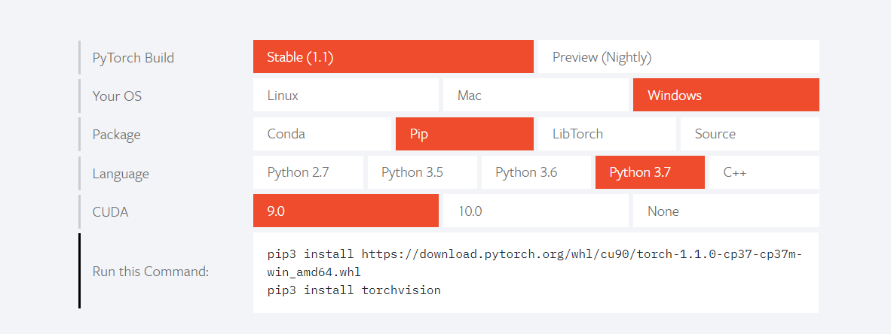

# Pytorch_learning
## 【Task1(2天)】PyTorch的基本概念

1. 什么是Pytorch，为什么选择Pytroch？
2. Pytroch的安装
3. 配置Python环境
4. 准备Python管理器
5. 通过命令行安装PyTorch
6. PyTorch基础概念
7. 通用代码实现流程(实现一个深度学习的代码流程)

### 1、什么是Pytorch，为什么选择Pytroch？
PyTorch 是一个深度学习框架，旨在实现简单灵活的实验。自 2017 年初首次推出，PyTorch 很快成为 AI 研究人员的热门选择并受到推崇。PyTorch 有许多优势，如采用 Python 语言、动态图机制、网络构建灵活以及拥有强大的社群等。由于其灵活、动态的编程环境和用户友好的界面，PyTorch 是快速实验的理想选择。  

最近在学习斯坦福cs231n的课程 上面讲到了Pytorch，做科研的人更适合使用Pytorch，没有Tensorflow那么臃肿，pytorch是使用动态图，效率更高一些，而且最新更新的Pytorch1.1有重大更新，与2018年12月正式发布的Pytorch1.0相比，这次发布的1.1版本提高了性能，并增加了新的模型理解和可视化工具，来提高可用性，还提供了新的API。详见文章[PyTorch大更新！谷歌出手帮助开发，正式支持TensorBoard](https://mp.weixin.qq.com/s/nLe4EPg_y6hX4TrYvTsgmw)  

对于研究生的我 感觉自己还是非常适合使用Pytorch，但是还是那句话，万变不离其宗，你这个框架学会的话理解了深度学习其中的概念，剩下的框架可能只是语法的问题了。

### 2. Pytroch的安装
介绍我自己的环境   
系统：window7  
使用环境：anaconda  
编译器：vscode 

Pytorch官网给出了具体的安装教程 对于自己环境选择相对于的安装方法就行
https://pytorch.org/
### 3、配置Python环境
比较推荐使用anaconda 具体为什么好用就不安利了 好用就对了  
[anaconda使用](https://www.jianshu.com/p/2f3be7781451)

我使用的是pip的方法在conda环境下安装的  
anaconda可以直接创建对应的python环境

首先创建自己的python虚拟环境
```
conda create -n pytorch-gpu python=3.7
activate pytorch-gpu
```


### 4、准备Python管理器
vscode编译器  
[vscode使用](https://www.jianshu.com/p/11554732b323)

### 5、通过命令行安装PyTorch

使用pip安装对应的pytorch版本  
我们去官网找到对应系统和python版本的安装方法  
https://pytorch.org/



我的环境是python3.7+cuda9.0
```
pip install https://download.pytorch.org/whl/cu90/torch-1.1.0-cp37-cp37m-win_amd64.whl
pip3 install torchvision
```
这里我使用的是cpu版本 gpu版本太大啦~ 安装其他版本的pytorch https://pytorch.org/get-started/previous-versions/
```
pip install https://download.pytorch.org/whl/cpu/torch-1.0.0-cp37-cp37m-win_amd64.whl
pip3 install torchvision
```

### 6. PyTorch基础概念
参照[pytorch handbook开源书籍](https://github.com/zergtant/pytorch-handbook)来对pytorch基础概念进行理解和实现一个深度而学习的pytorch代码实现  

对四个部分进行理解  
1、[张量](https://github.com/xiaoming3526/Pytorch_learning/blob/master/Task1/1.%E5%BC%A0%E9%87%8F.md)   
2、[自动求导](https://github.com/xiaoming3526/Pytorch_learning/blob/master/Task1/2.自动求导.md)  
###
后面这块的已经是后面部分的内容 之后在更新~  
3、神经网络包nn和优化器optm  
4、数据的加载和预处理  


### 7. 通用代码实现流程(实现一个深度学习的代码流程) 
#### MNIST数据集手写数字识别
详细代码见：https://github.com/xiaoming3526/Pytorch_learning/blob/master/src/mnist.py

参考地址：https://github.com/zergtant/pytorch-handbook/blob/master/chapter3/3.2-mnist.ipynb