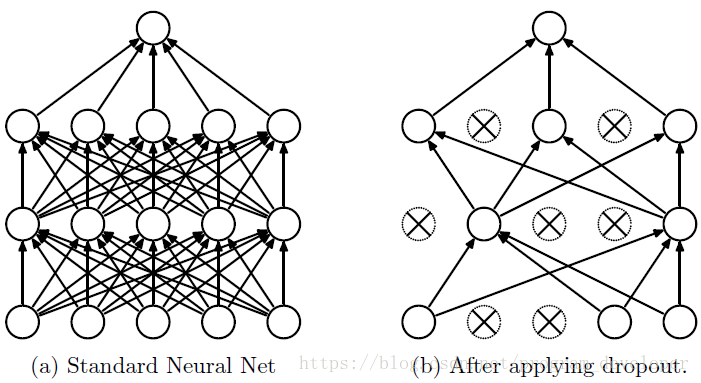

# Pytorch_learning

## 【Task5(2天)】PyTorch实现L1，L2正则化以及Dropout(给代码截图参考)
1. 了解知道Dropout原理
2. 用代码实现正则化(L1、L2、Dropout）
3. Dropout的numpy实现
4. PyTorch中实现dropout


### 1. 了解知道Dropout原理


在机器学习的模型中，如果模型的参数太多，而训练样本又太少，训练出来的模型很容易产生过拟合的现象。
Dropout可以比较有效的缓解过拟合的发生，在一定程度上达到正则化的效果。

Dropout可以作为训练深度神经网络的一种trick供选择。在每个训练批次中，通过忽略一半的特征检测器（让一半的隐层节点值为0），可以明显地减少过拟合现象。这种方式可以减少特征检测器（隐层节点）间的相互作用，检测器相互作用是指某些检测器依赖其他检测器才能发挥作用。

Dropout说的简单一点就是：我们在前向传播的时候，让某个神经元的激活值以一定的概率p停止工作，这样可以使模型泛化性更强，因为它不会太依赖某些局部的特征，如下图所示。



### 2. 用代码实现正则化(L1、L2、Dropout）
L1 正则化公式很简单，直接在原来的损失函数基础上加上权重参数的绝对:值  
$L=E_{in}+\lambda\sum_jw_j^2$  
L2 正则化公式也非常简单，直接在原来的损失函数基础上加上权重参数的平方和:    
$L=E_{in}+\lambda\sum_j|w_j|$  
实现代码：
```
import torch
import torchvision

model=torchvision.models.vgg16()

def Regularization(model):
    L1=0
    L2=0
    for param in model.parameters():
        L1+=torch.sum(torch.abs(param))
        L2+=torch.norm(param,2)
    return L1,L2
mnist=torchvision.datasets.mnist

```
### 3. Dropout的numpy实现
```
"""
inverted dropout（反向随机失活）: 推荐实现方式.
在训练的时候drop和调整数值范围，测试时不用任何改变.
"""
p = 0.5 # 激活神经元的概率. p值更高 = 随机失活更弱

def train_step(X):
    # 3层neural network的前向传播
    H1 = np.maximum(0, np.dot(W1, X) + b1)
    U1 = (np.random.rand(*H1.shape) < p) / p # 第一个dropout mask. 注意/p!
    H1 *= U1 # drop!
    H2 = np.maximum(0, np.dot(W2, H1) + b2)
    U2 = (np.random.rand(*H2.shape) < p) / p # 第二个dropout mask. 注意/p!
    H2 *= U2 # drop!
    out = np.dot(W3, H2) + b3
    # 反向传播:计算梯度... (略)
    # 进行参数更新... (略)
    
def predict(X):
# 前向传播时模型集成
H1 = np.maximum(0, np.dot(W1, X) + b1) 
H2 = np.maximum(0, np.dot(W2, H1) + b2)
out = np.dot(W3, H2) + b3
```


### 4. PyTorch中实现dropout

具体代码见:https://github.com/xiaoming3526/Pytorch_learning/blob/master/src/Task5/1.py